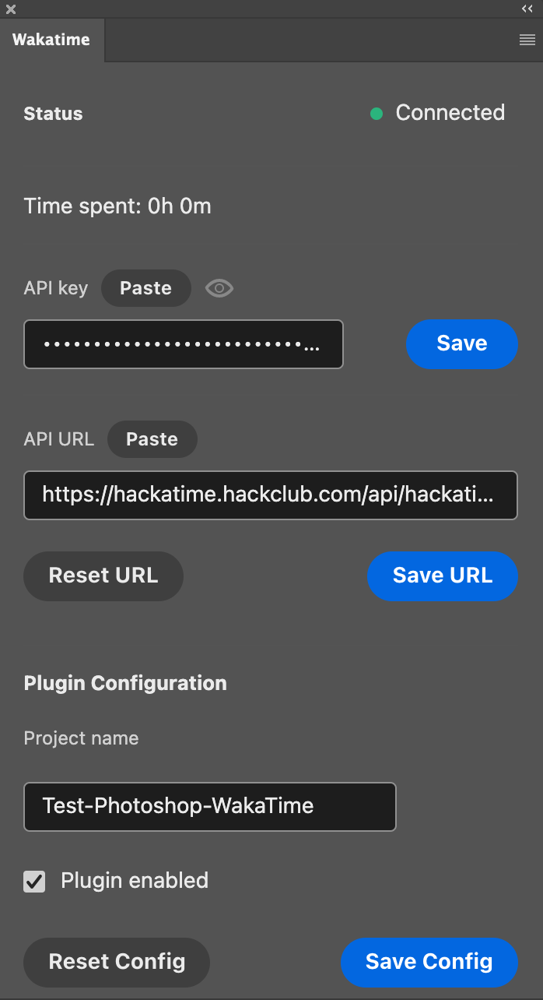

# Wakatime Adobe Plugin

<table>
   <tr>
      <td><a href="#installation">Installation</a></td>
      <td><a href="#updating">Updating</a></td>
      <td><a href="#usage">Usage</a></td>
      <td><a href="#known-issues">Known Issues</a></td>
      <td><a href="#development">Development</a></td>
   </tr>
</table>

---



---

Adobe Wakatime brings [Wakatime](https://wakatime.com/)'s time-tracking functionality to Adobe products.

It works by using Adobe's CEP API to retrieve details like the application name, version, operating system, and machine info. The plugin detects activity by monitoring changes to the active project file every 30 seconds and sending a heartbeat if any change is detected!

**Currently supported features:**

- [x] Tracking time (every 30 seconds)
- [x] Tracking file path
- [x] Tracking file name
- [x] Tracking machine name
- [x] Tracking editor name
- [x] Tracking OS name

> **Note** > **💡** This plugin requires an internet connection and **will not track** time while offline.
>
> **💡** You can modify the project name, language, category, etc. using the [Custom rules](https://wakatime.com/settings/rules) in your dashboard.

## Supported Adobe Applications

This plugin uses **Adobe Manifest v5** and **Adobe CEP 11**.

### Applications supported:

- Photoshop (only if `legacy` is available)
- After Effects
- Audition
- Illustrator
- Premiere Pro
- **Please note:** these applications have been tested with this plugin, there may be other compatible Adobe applications that are not listed here.

## Installation

<!--

### UXP Compatible Applications

<details open>
<summary><b>Applications supported:</b></summary>
<blockquote>

- Photoshop
- XD has its [own implementation here](https://wakatime.com/adobe-xd)

</blockquote>
</details>

1. Download the latest version of `wakatime-adobe-uxp.zip` from the [Releases page](https://github.com/Irtaza2009/adobe-wakatime/releases) or [click here to download directly](https://github.com/Irtaza2009/adobe-wakatime/releases/latest/download/wakatime-adobe-uxp.zip).
2. Locate the plugins folder (default location):
   - > **IMPORTANT** > **If the directory does not exist, you must create it manually.**
   - **Windows:** `C:\Program Files\Adobe\Adobe Photoshop 20xx\Plug-ins\`
   - **macOS:** `~/Library/Applications/Adobe Photoshop 20xx/Plug-ins/`
3. Extract the `wakatime-adobe` folder from the downloaded zip file into the `Plug-ins` folder.

-->

> **Warning**
> You **must Enable loading of unsigned panels**. You can find the [tutorial on how to do it here](https://github.com/Adobe-CEP/Samples/tree/master/PProPanel#2-enable-loading-of-unsigned-panels).

1. Download the latest version of `wakatime-adobe-cep.zip` from the [Releases page](https://github.com/Irtaza2009/adobe-wakatime/releases) or [click here to download directly](https://github.com/Irtaza2009/adobe-wakatime/releases/latest/download/wakatime-adobe-cep.zip).
2. Locate the extensions folder (CEP supports 2 types of folders for unsigned extensions):

   - > **IMPORTANT** > **If the directory does not exist, you must create it manually.**

   - **System extension folder**

     - **Win(x86):** `C:\Program Files (x86)\Common Files\Adobe\CEP\extensions\`
     - **Win(x64):** `C:\Program Files\Common Files\Adobe\CEP\extensions\`
     - **macOS:** `~/Library/Application Support/Adobe/CEP/extensions/`

   - **Per-user extension folder**
     - **Windows:** `C:\Users\<USERNAME>\AppData\Roaming\Adobe\CEP\extensions\`
     - **macOS:** `~/Library/Application Support/Adobe/CEP/extensions/`

3. Extract the `wakatime-adobe` folder from the downloaded zip file into the `extensions` folder.

### Updating

To update, follow the same steps as the initial [installation](#installation).
Then remove the previous `wakatime-adobe` folder and replace it with the latest version from the zip file.

## Usage

> **Important** > **THE PANEL WINDOW MUST NOT BE CLOSED.** > **YOU CAN EXPAND/COLLAPSE/DOCK OR JUST KEEP IT AS A FLOATING WINDOW BUT NEVER CLOSE THE PANEL.**

1. Open the Adobe application after you install this plugin.
   > **Important** > **A project must be open for the plugin to work! Open a project first before launching the plugin.**
2. Select in the toolbar:

   (CEP) **Window > Extensions > Wakatime**

   <!-- (UXP) **Plugins > Wakatime**;
   or **Plugins panel** and choose **Plugins > Plugins panel > Wakatime**.
   -->

3. Paste your **API key** into the input field and click the **Save** button ([Get your API key here](https://wakatime.com/api-key)).

   > 3.5. If you want to track time using [Hackatime](https://hackatime.hackclub.com), update the API URL to:
   > `https://hackatime.hackclub.com/api/hackatime/v1`

<!--
4. **(Optional, UXP only)** Provide your machine name ([found in your dashboard](https://wakatime.com/dashboard)) in the **Machine name** input field. Setting this field helps avoid displaying "Unknown Hostname" on your dashboard.
-->

4. The `status` should automatically update after 30 seconds if the plugin is tracking time (it sends data every 30 seconds)
   - If it still shows "Disconnected," make sure you have an open file for the plugin to work. Don't worry if it initially shows "Disconnected" before you open a file.
5. To disable the plugin, **uncheck** the "Plugin enabled" checkbox.
6. Select in the toolbar:

   Windows: **Edit > Preferences > Autosave**

   macOS: **{Application Name} > Preferences > Autosave**

   And make sure "Automatically save projects" is checked and the auto-save time is set to <= 2 minutes.

### Status Meaning

-  **Connected** - The plugin is working as intended.
-  **Unauthorized** - The provided API key is likely invalid, or you do not have permission to access the resource.
-  **Disconnected** - The plugin only works when you have an open file and an internet connection. Make sure you have an open file and you are not on the Home screen.
-  **Unavailable** - The server responded with an `error 500` and is currently unavailable.
-  **Disconnected (despite being working before)** - The plugin may have sent too many requests in a short period and hit a rate limit.

> **Note** > **The status may show "Disconnected" for any connection error or bad request.**

## Known Issues

- Config is randomly cleared when you close the application.

  > Sometimes the plugin storage may be completely cleared when updating the extension or the application. There's no fix from my side for this.

- The connection status always shows as Disconnected

  > Arrr. If you're sailing with the Caribbean version of the application, check if there are no rules in your Firewall that are blocking connections.

- The CEP panel may not allow writing while holding the `⇧ Shift` key.

  > Workaround: use `⇪ Caps Lock` key.

- The CEP panel may not allow writing into input fields.

  > Workaround: simply copy and paste the text.

- The CEP panel may not allow copy and pasting into input fields.
  > Workaround: simply type into the input fields.

---

## Development

### CEP

#### Development Workflow for CEP

1. Install the project dependencies, execute: `npm install`
2. Run the CEP watch mode to automatically rebuild the plugin whenever changes are made. Execute: `npm run watch:cep`

#### Debugging CEP Plugins

To use the CEP plugin with the supported Adobe applications (listed in [`plugin/CSXS/manifest.xml`](./plugin/CSXS/manifest.xml)), you need to copy the `dist` folder to the appropriate location. The [`CEP.sh`](./scripts/CEP.sh) shell script automates this process.

_Follow the steps below to correctly debug the plugin:_

1. Locate the `CEP.sh` file in the `scripts` folder.
2. Open the `CEP.sh` file and specify the destination folder path for the `extensions` folder. Update the script accordingly (see [Installation](#installation) for the default paths)
3. Save the changes to the `CEP.sh` file.
4. Run the `CEP.sh` script. It will automatically copy the `dist` folder to the defined path.
5. Open any of the supported applications and open the plugin panel. Select **Window > Extensions > Wakatime** in the toolbar.
6. Open your browser, a Chromium-based browser is recommended for the best experience, and navigate to default host port [`localhost:7778`](http://localhost:7778/) (you can manually update all hosts debugging ports in [`plugin/.debug`](./plugin/.debug) file)
7. Whenever you make changes to the CEP plugin code, run the `CEP.sh` script again. In the DevTools, click the reload button (located at the top-left corner) to load the updated version of the CEP plugin.

<!--
### UXP

#### Prerequisites UXP

1. Install the [Adobe UXP Developer Tool](https://github.com/adobe-uxp/devtools-cli) by following the instructions provided in the repository.
2. Enable Developer Mode if available (eg. in Photoshop), go to **Edit > Preferences > Plugins > Enable Developer Mode** (you will need to relaunch Photoshop for the changes to take effect)

#### Development Workflow for UXP

1. Install the project dependencies, execute: `npm install`
2. Run the UXP watch mode to automatically rebuild the plugin whenever changes are made. Execute: `npm run watch:uxp`
3. Launch the UXP Developer Tools application.
4. Load the plugin directly in Adobe Photoshop using the UXP Developer Tools application:
   1. Click on "Add Plugin..." and navigate to the [`dist/manifest.json`](./dist/manifest.json) file in the project directory.
      - **Make sure that you use the `dist` folder and NOT the `plugin` folder when loading the plugin.**
   2. If the plugin was not automatically loaded, click "Load" in the action dropdown menu (three dots)
5. Enable live-reloading, click "Watch" in the action dropdown menu (three dots)
6. In the same dropdown menu, you can open the Chrome/Plugin dev tools by clicking "Debug"

-->

---

## Building

To build the CEP plugin, execute the following command:

```shell
npm run build:cep
```

This command will compile the CEP. The generated files will be packaged into a `zip` file located in the `release` folder as `wakatime-adobe-cep`. Code optimizations will be applied and some debugging files removed.

> **Warning**
> Sometimes Typescript loses track of [CSInterface library](./plugin/lib/CSInterface.js). To fix any errors, copy the file from `plugin/lib/CSInterface.js` to the `src` folder.

---

You can find all [CEP 11 documentation here](https://github.com/Adobe-CEP/CEP-Resources/blob/master/CEP_11.x/Documentation/CEP%2011.1%20HTML%20Extension%20Cookbook.md).

---

## Credits

Made with ❤️ by **[Irtaza](https://irtaza.xyz/)**

Please **star** the [repo](https://github.com/Irtaza2009/adobe-wakatime/)!!

**Slack: [@Irtaza](https://hackclub.slack.com/team/U079EQY9X1D)**

